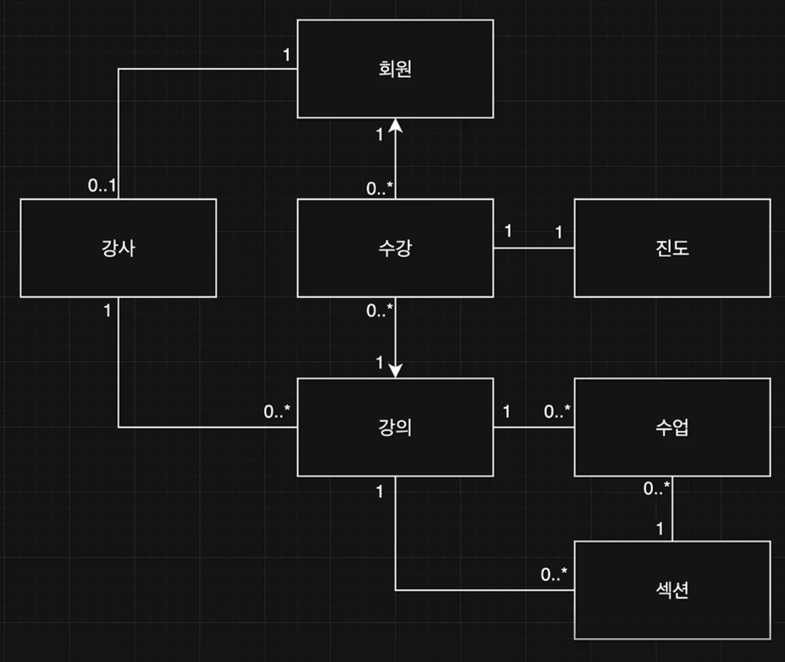

# 도메인 모델
> 💡 도메인의 추상화된 형태
- 도메인 모델은 소프트웨어가 해결하려는 특정 문제 영역
- 도메인에 존재하는 중요한 개념과 이들의 관계, 규칙을 표현
  - 온라인 서점
    - 책, 고객, 주문, 장바구니
    - 고객은 책을 주문한다
    - 장바구니의 책의 가격과 수량으로 총액을 계산한다

# 도메인 주도 설계
> 도메인의 **복잡성이 주는 문제를 해결**하기 위한 접근법
- 도메인 모델을 개발 과정에 중심에 두는 방법론
- 도메인 모델이 설계와 코드까지 이어져야 한다( 모델 주도 설계 )
- 팀 안에서 **도메인 모델에 기반한 단일 어휘체계**를 만들고, 일관되게 사용한다 ( 보편 언어 )

## 도메인 모델 만들기
- 듣고 배우기
- **중요한 것**들 찾기 ( 개념 식별 )
- **연결 고리** 찾기 ( 관계 정의 )
- **것** 들을 설명하기 ( 속성 및 기본 행위 명시 )
- 그려보기 ( 시각화 )
- 이야기하고 다듬기 ( 반복 )

## 도메인 모델 다이어그램
