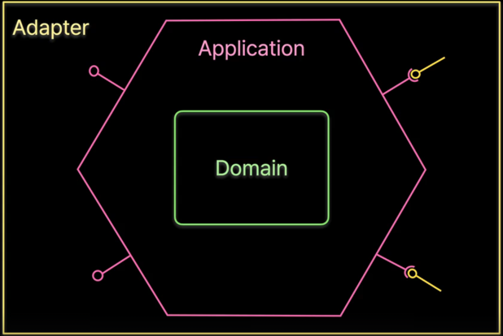

# 아키텍처
> 시스템의 기본적인 구조를 정의
- 설계 결정의 기반이 된다
- 기본 구성 요소와 상호 관계, 제약 조건, 원칙 등을 퐇마한다

### [1]. 계층형 아키텍처 ( Layered Architecture )
- 계층으로 구조화하는 아키텍처 스타일
- 상위 계층이 하위 계층을 참조하는 단방향 흐름

#### Layers of Isolation
- 각 계층은 하위 계층의 내부 작동 방식을 알지 못하고, 인터페이스만 사용
- 레이어의 변경은 다른 레이어에 가능한 영향을 주지 않아야 한다

### [2]. 헥사고날 아키텍처 ( Hexagonal Architecture )

- 애플리케이션의 내부와 외부로 구분한 대칭형 아키텍처
- `✨ 테스팅` 운영 시스템에 종속되지 않은 테스트
  - 애플리케이션과 `Actor`가 바뀌더라도 다시 빌드하지 않고 테스트
- 기술 요소를 제거하고, 도메인 설계에 집중

#### [2 - 1]. 헥사곤의 외부
- 애플리케이션과 상호작용하는 모든 것 -> `Actor`
  - 사용자, 브라우저, CLI 명렁, 다른 시스템 ...
  - 운영 환경, DB, 메시징 시스템, 메일 시스템 ...
  - 테스트
- `Primary Actor`: 애플리케이션이 제공하는 기능을 사용하는 액터
- `Secondary Actor`: 애플리케이션이 동작하는 데 필요한 기능을 제공하는 액터

#### [2 - 2]. 포트 ( Port )
- 애플리케이션이 외부와 **의도(Intention)를 가지고 상호작용** 하는 아이디어를 캡쳐한 것
- 명확한 목적과 방향을 가지고 외부와 연결
  - 회원 등록
  - 회원 정보 저장
  - 이메일 발송
##### 인터페이스
- `Lollipop`: 기능 제공 인터페이스 ( Provided Interface ) 
  - 애플리케이션이 제공하는 기능을 외부에서 사용할 수 있게 노출한 것
- `Socket`: 기능 요구 인터페이스 ( Required Interface )
  - 애플리케이션이 필요한 기능을 요구하는 인터페이스

#### [2 - 3]. 어댑터( Adapter )
- 애플리케이션의

### [3]. 헥사고날 아키텍처의 오해와 사실
#### [오해 1]. 애플리케이션 내부에 도메인 계층을 만들어야 한다
- 헥사고날 아키텍처는 애플리케이션 내부 구현에 대한 원칙이나 요구사항이 없다
  - 트랜잭션 스크립트, 도메인 모델 패턴 등 내부 원칙에 제한이 없다.
- 도메인 계층을 포함하는 아키텍처는 `클린 아키텍처`이다

#### [오해 2]. 헥사고날 아키텍처 패키지 구조를 따라야 한다.
- 헥사고날 아키텍처가 요구하는 패키지 구조는 없다.
- 하지만, 애플리케이션과 어댑터 패키지를 분리하는 것은 바람직함
- 포트를 구분된 패키지에 두는 것도 좋다.

#### [오해 3]. 포트는 UseCase라는 접미사를 사용한다
- 포트의 의도를 담은 이름을 사용하면 된다
- `For + ~ing` 스타일의 권장 네이밍은 있지만, 필수는 아님.

#### [오해 4]. 애플리케이션에는 도메인 모델만 넣고, JPA Entity 등의 영속성 객체를 어댑터에 배치
- 애플리케이션 코드와 포트 인터페이스가 외부 기술에 의존하지 않으면 된다.

#### [사실]
- 애플리케이션은 모든 외부와의 상호작용을 위해 `Provided Interface`와 `Required Interface`를 정의한다.
- 애플리케이션과 상호작용하는 `Actor`는 **런타임에 구성**되어야 한다.
- 애플리케이션은 **Actor에 대한 코드 의존성**을 가지면 안 된다.
- `Actor`는 정의된 포트를 통해서만 연결해야 한다
- 포트의 인터페이스는 기술 의존성을 가지지 않는다.
  - ~~HttpCookie~~
  - ~~DBConnection~~
